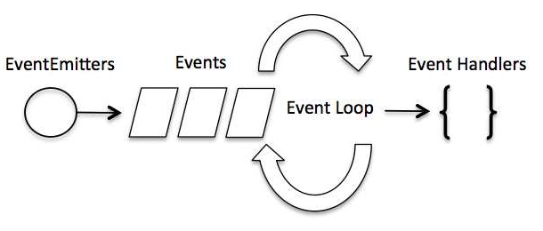

## Event-Driven Programming  

  

=> callback function are called when an asynchronous function return its result => event handling works on the observer pattern  

> EventEmitter 

```
// Import events module
var events = require('events');

// Create an eventEmitter object
var eventEmitter = new events.EventEmitter();

// Bind event and event  handler as follows
eventEmitter.on('eventName', eventHandler);

// Fire an event 
eventEmitter.emit('eventName');
```  

> Example  

```
// Import events module  
var events = require('events');

// Create an eventEmitter object
var eventEmitter = new events.EventEmitter();

// Create an event handle as follows  
var connectHandler = function connected() {
    console.log('connection sucessful.');

    // Fire the data_received event
    eventEmitter.emit('data_received');
};

// Bind the connection event with the handler
eventEmitter.on('connection', connectHandler);

// Bind the data_receive event with the anonymous function
eventEmitter.on('data_receive', function () {
    console.log('data received successfully.');
});

// Fire the connection event
eventEmitter.emit('connection');

console.log('Program Ended..');
```  

> Run  

```
$ node event-main.js
connection sucessful.
data received successfully.
Program Ended..
```  

## How Node Application Work ?  

> readFile example  

```
var fs = require("fs");

fs.readFile('input.txt', function (err, data) {
   if (err){
      console.log(err.stack);
      return;
   }
   console.log(data.toString());
});
console.log("Program Ended");
```  

=> 
if an error occur during the read operation  
 -> err object will contain the corresponding error  
else  
 -> data will contain the contents of the file  

=>  
 readFile() passes err and data to the callback function


---  

https://www.tutorialspoint.com/nodejs/nodejs_event_loop.htm